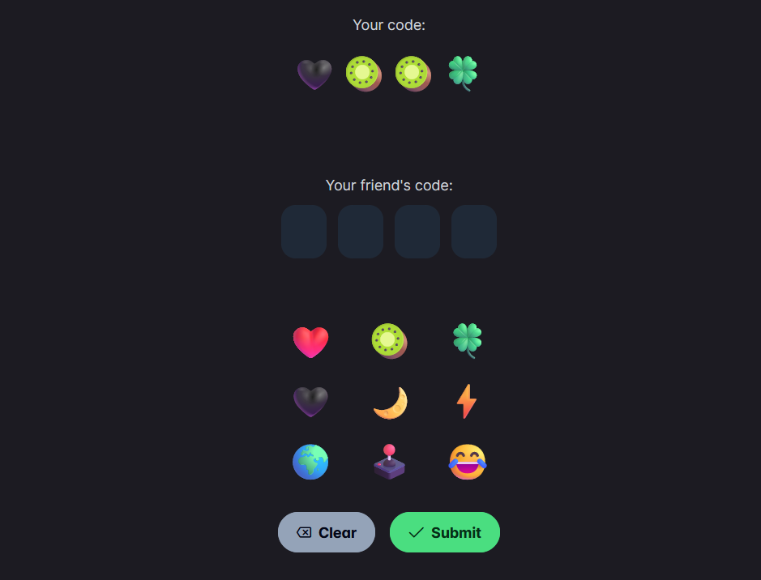
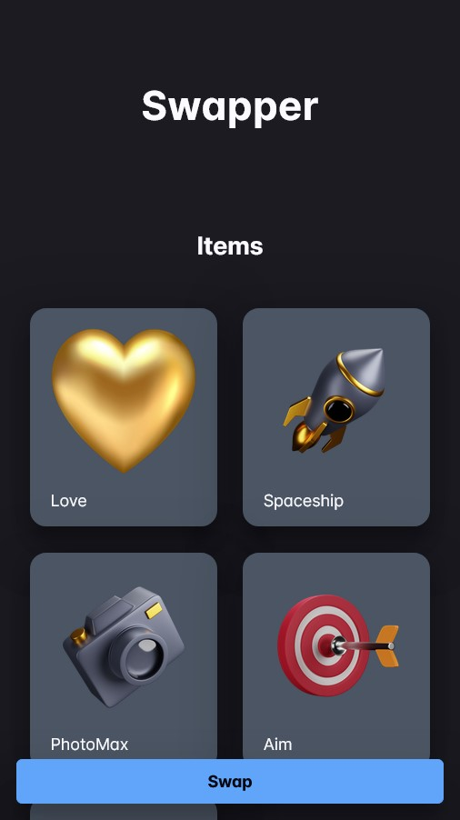

# ItemSwapper

Status: `DRAFT`

## Made with:
Frontend

- `Angular` 
- `PrimeNG` 
- `Socket.io`

Backend
- `Express`
- `MongoDB`
- `Socket.io`
- `jsonwebtoken`

## About the project
The main idea of the project is to develop an application for events and parties to encourage participants to interact more with each other.

How it should work:
- Participants register in the application
- At a certain point in time, items are distributed between them
- During the event, participants exchange items with others in order to collect everything as quickly as possible

Item exchange occurs when two participants enter each other's Emoji code: 

## What's items?
Nothing.

Just images with names.

## Usage
You can place your own items (jpg images) to src/assets/items. The app uses filename (before .jpg) as identifier

But not there is no functionality to add items to user. So the only way to add them manually (in database for example)

- `ng serve` to run frontend
- `npm run server` to run backend

## Status
It's just a draft now

Now it only can show do authentication, display items, connect to other user, but without actual exchange.

